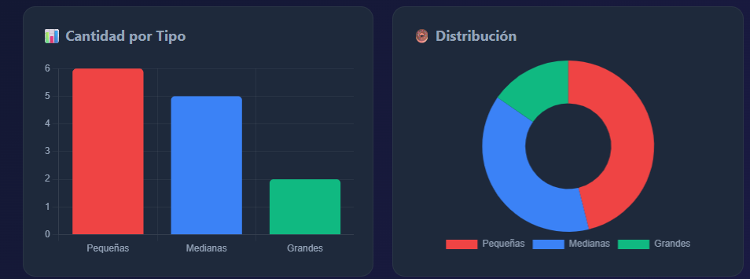

# ⚙️ Dashboard IoT – Faja Clasificadora  
Interfaz web moderna para monitorear en tiempo real una **faja transportadora IoT** con sensores láser, conteo automático y control del motor conectado a la nube mediante API REST.

🌐 **Frontend 100% responsive**  
🚀 **Conexión directa al backend Render**  
📡 **Lectura de sensores en tiempo real**  
📊 **Gráficos dinámicos con Chart.js**  
🟢 **Visualizador 2D animado de la faja**

---

## 📸 Vista Previa del Dashboard




---

## 🚀 Funcionalidades Principales

### 🎛️ **1. Conexión a la nube (Render API)**
- Se conecta con:  
  **https://faja-backend-api.onrender.com**
- Verifica estado con `/api/status`
- Obtiene eventos con `/api/events`

### 🧲 **2. Visualizador 2D de la Faja**
- Animación realista del movimiento.
- 3 sensores láser con LED verde/rojo.
- Indicador de motor activo.

### 📊 **3. Gráficos**
- **Bar Chart:** Conteo de objetos por sesión  
- **Pie Chart:** Distribución porcentual  
- Datos sincronizados en tiempo real.

### 📝 **4. Historial por turnos**
- Fecha + Hora + Turno + Tipo  
- Limpieza de sesión  
- Exportación CSV

---

## 🏗️ Estructura del Proyecto
    Proyecto-Faja-IoT/
    ├── index.html
    ├── LICENSE
    └── README.md

    
No necesita carpetas adicionales. Todo el CSS y JS están incrustados en `index.html`.

---

## 📦 Tecnologías Utilizadas

| Tecnología | Uso |
|-----------|-----|
| **HTML5 + CSS3** | Interfaz gráfica + animaciones |
| **JavaScript** | Consumo API + lógica en tiempo real |
| **Chart.js** | Gráficos dinámicos |
| **Render** | Backend en la nube |
| **Fetch API** | Conexión a sensores/motor |

---

## 🔌 Endpoints del Backend (Render)

Frontend consume estos endpoints:

| Endpoint | Descripción |
|----------|-------------|
| `/api/status` | Estado del motor + sensores + contadores |
| `/api/events` | Lista de eventos detectados |
| `/api/motor/start` | Inicia el motor |
| `/api/motor/stop` | Detiene el motor |

---

## ▶️ Cómo Ejecutar el Proyecto

### **1️⃣ Clonar**
```sh
git clone https://github.com/tuusuario/proyecto-faja-frontend.git
```

### **2️⃣ Abrir con VS Code**

```sh
Copiar código
code proyecto-faja-frontend
```

### **3️⃣ Abrir en el navegador**

``` Solo abre index.html
No requiere servidor local.
